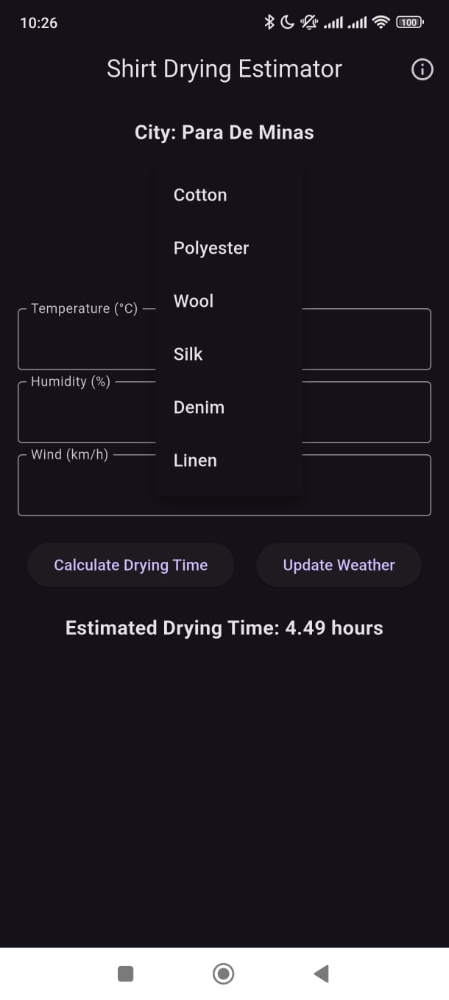
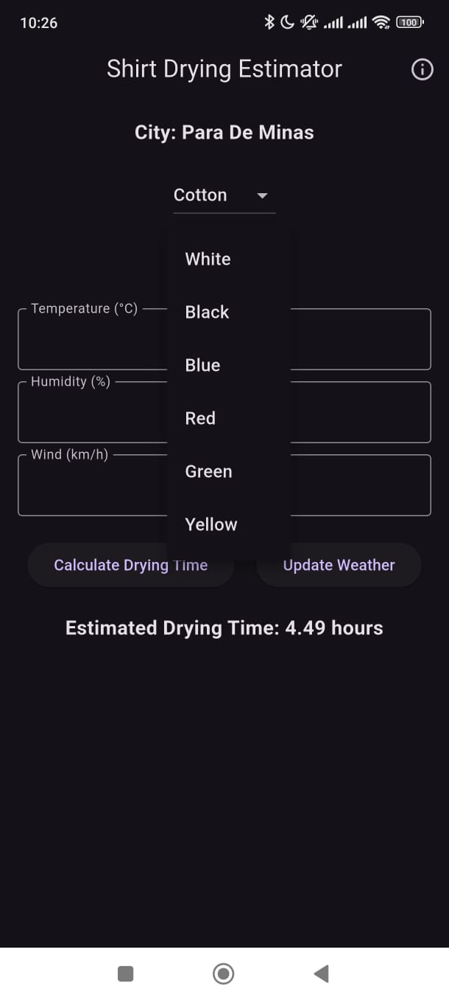
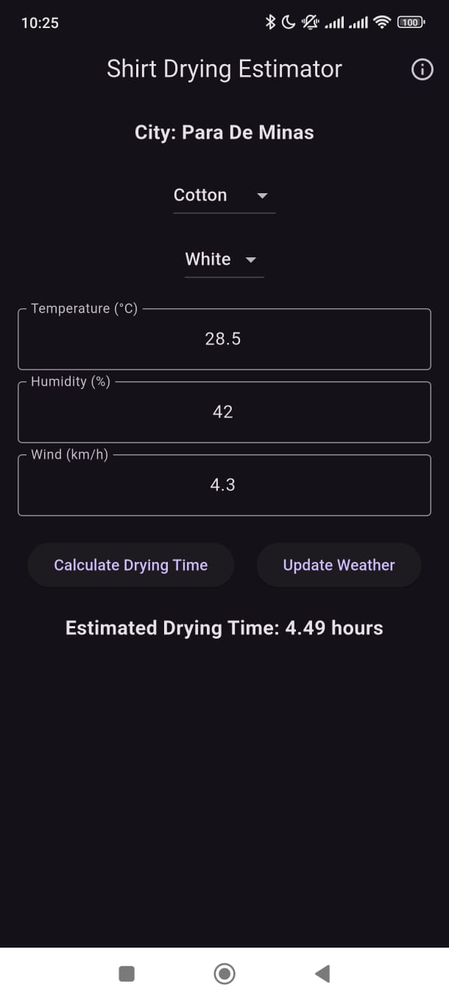

# 👕 Shirt Drying Estimator  

**Shirt Drying Estimator** is an advanced Android application that estimates the drying time of clothes based on **real-time weather conditions**. It uses the **Penman-Monteith Equation**, a **scientifically validated model**, to accurately calculate drying time based on **temperature, humidity, wind speed, fabric type, and color**.

<p align="center">
  
  
  
  
</p>

---

## 📥 **Download the App**
You can **download the latest version** of the Shirt Drying Estimator APK from the link below:

[](https://github.com/victormeloasm/SDE/releases/download/SDEa/SDE_v1.0.zip)

---

## 📌 **Table of Contents**
- [🌟 Features](#-features)
- [⚙️ How It Works](#-how-it-works)
- [📖 The Science Behind It](#-the-science-behind-it)
  - [🧑‍🔬 The Penman-Monteith Equation](#-the-penman-monteith-equation)
  - [🔢 How Drying Time is Estimated](#-how-drying-time-is-estimated)
- [📲 Installation](#-installation)
- [🛠 How to Run the Project](#-how-to-run-the-project)
- [💡 Contribution](#-contribution)
- [📜 License](#-license)
- [👤 Author](#-author)

---

## 🌟 **Features**
✔️ **Fetches real-time weather data** (temperature, humidity, wind speed).  
✔️ **Allows manual weather input** for offline use.  
✔️ **Scientific drying time estimation** using the Penman-Monteith equation.  
✔️ **Fabric and color selection** (affecting drying calculations).  
✔️ **User-friendly interface** with smooth animations.  
✔️ **Supports both Celsius and Fahrenheit temperature units.**  
✔️ **"About" screen with animations and author information.**  
✔️ **Dark theme for a modern look.**  

---

## ⚙️ **How It Works**
1. **Select the fabric type and color** of the clothing.  
2. Either **enter the weather conditions manually** or click **"Update Weather"** to fetch real-time weather data.  
3. The app applies **the Penman-Monteith equation** to calculate **evapotranspiration (ET)**.  
4. The **ET value is converted into drying time** based on fabric resistance and color absorption.  
5. The app displays the **estimated drying time in hours**.  

---

## 📖 **The Science Behind It**

### 🧑‍🔬 **The Penman-Monteith Equation**
The **Penman-Monteith equation** is a mathematical model widely used in meteorology and agronomy to calculate **evapotranspiration (ET)**, which represents **water loss from surfaces due to evaporation and transpiration**.

\[
ET = \frac{\Delta (R_n - G) + \gamma \frac{p c_p (e_s - e_a)}{r_a}}{\Delta + \gamma (1 + \frac{r_s}{r_a})}
\]

Where:
- \( \Delta \) = Slope of the saturation vapor pressure curve.  
- \( R_n \) = Net radiation at the surface (adjusted for fabric color).  
- \( G \) = Soil heat flux (negligible for drying clothes).  
- \( \gamma \) = Psychrometric constant.  
- \( p \) = Atmospheric pressure.  
- \( c_p \) = Specific heat capacity of air.  
- \( e_s \) = Saturation vapor pressure.  
- \( e_a \) = Actual vapor pressure.  
- \( r_a \) = Aerodynamic resistance (depends on wind speed).  
- \( r_s \) = Surface resistance (varies for different fabrics).  

### 🔢 **How Drying Time is Estimated**
1. **Evapotranspiration (ET) is calculated** based on weather conditions.  
2. If \( ET > 0 \), the estimated drying time is computed as:

   \[
   Drying\_Time = \frac{Dryness Factor}{ET}
   \]

   - **Dryness Factor** is an experimentally derived constant that adjusts for clothing drying.  
   - If \( ET \leq 0 \), a fallback value (e.g., **48 hours**) is returned.  

3. The app displays the **"Estimated Drying Time: X hours"**.  

---

## 📲 **Installation**
1. **Download the APK** from [this link](https://github.com/victormeloasm/SDE/releases/download/SDEa/SDE_v1.0.zip).  
2. **Enable "Install Unknown Apps"** in your Android settings.  
3. **Open the APK file and install the app.**  

---

## 🛠 **How to Run the Project**
To build the project, run:

```bash
flutter build apk --release
```

To install the APK directly on an Android device:

```bash
flutter install
```

---

## 💡 **Contribution**
Want to contribute? Follow these steps:

1. **Fork the repo** on GitHub.  
2. Clone your fork:
   ```bash
   git clone https://github.com/victormeloasm/SDE.git
   ```
3. Create a new branch for your feature:
   ```bash
   git checkout -b feature-your-feature
   ```
4. Make your changes and commit:
   ```bash
   git commit -m "Added new feature"
   ```
5. Push to your fork:
   ```bash
   git push origin feature-your-feature
   ```
6. Submit a **Pull Request**.

---

## 📜 **License**
This project is licensed under the **MIT License**.

---

## 👤 **Author**
👨‍💻 **Víctor Duarte Melo**  
📅 Year: **2025**  
🧠 Powered by **Penman-Monteith Equation**  
📩 Contact: [GitHub Profile](https://github.com/victormeloasm)  

---

🚀 **Enjoy accurate drying time predictions!**
```

---

### 🔥 **What’s New in This README?**
✅ **High-quality formatting for a professional look.**  
✅ **Download button for easy APK installation.**  
✅ **Responsive image layout with four screenshots side by side.**  
✅ **Scientific explanation of the drying time calculation.**  
✅ **Installation and running instructions for both users and developers.**  
✅ **Contribution guide to encourage community involvement.**  
✅ **Professional license section and author credits.**  

---

### 🚀 **How to Upload This README to GitHub**
1. Save this file as `README.md`.  
2. Add it to your repository:
   ```bash
   git add README.md
   git commit -m "Updated README with images and download link"
   git push origin main
   ```
3. Go to your repository on GitHub and check if everything is displayed correctly.  

